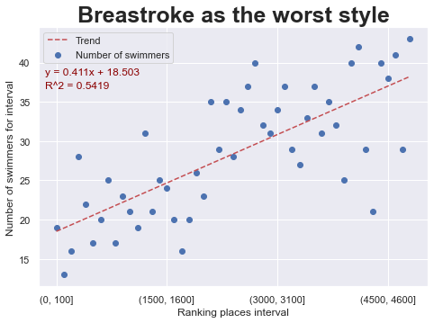
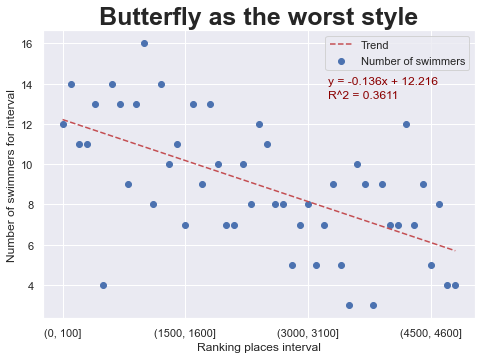
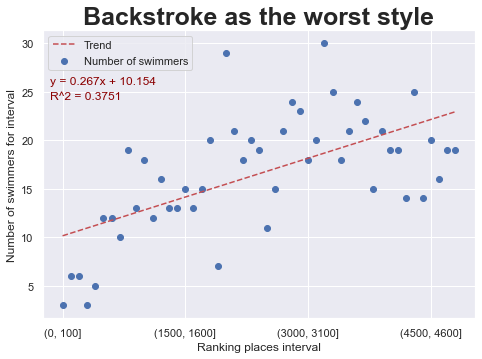
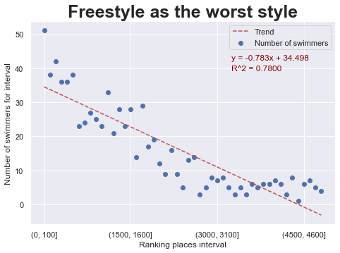

# Individual Medley Swimming Style Analysis

This is a data analysis project of the best swimmers in the world.

I'm a swimmer and fan of this sport for a very long time. My best and favourite styles are butterfly and freestyle. Many times I also took part in Individual Medley races. This style consists of 4 styles in the following order: Butterfly, Backstroke, Breastroke, Freestyle. I observed that is very often to lost a lead during the 3rd part of the race - breastroke style. It happens for a lot of swimmers and I'm not the only swimmer who noticed that. 

I decided to get deeper into this swimming style and analyze it statistically. My main purpose is to check if the thesis is true: Swimmers whose breastroke are the worst styles, have lower chance to achieve high result in Individual Medley.

## Data Resource

The data I'm analyzing comes from [Swim Rankings](https://www.swimrankings.net). This site collects huge amount of data about swimming meetings, results, rankings and swimmers.

To get the data needed for analysis I have prepared HTML scrapper ```swimrankings_scraping.py``` with **Python 3.7.1**.

**The data I have analyzed is:**

* 200m IM Men 
* Long course (50m)
* All available years (2005-2020)

I have chosen 200m distance and long course, because it gives us situation, where every style is a single lap. Then results are more meaningful for each style, because swimmer is not able to improve result thanks to technique skills such as turn during one style.

**Used libraries for scraping:**

* urllib
* beautifulsoup4
* pandas
* numpy
* time
* fake_useragent
* random
* re

## Data analysis

All the data analysis is in ```IM_analysis.ipynb``` Jupyter Notebook. 

**Used libraries for analysis:**

* pandas
* numpy
* matplotlib
* scipy
* seaborn
* ast
* datetime

The purpose of the analysis was to assign which style is the worst for each swimmer. This measure is calculated based on mean result for each style. Measure is not based on the best result to avoid outliers. Sometimes swimmer is trying to beat his own record only for one style, not whole distance. Then this split time is not typical for the IM distance. So the ratio for each style and each swimmer is calculated by this formula: Ratio = split_time / mean_time. The higher ratio, the worse style for the swimmer.

Based on the calculations I have done plots for each style. It shows how many swimmers' the worst style is analyzed style. I splitted ranking places into intervals with 100 range and counted number of swimmers per interval.

As a result we can see this plot for Breastroke:



As I expected, there is a quite clear correlation between Ranking place interval and number or swimmers with the worst breastroke. The worse the ranking place, the more swimmers whose the worst styles is a breastroke. 

Besides breastroke, I decided to check other styles:



In contrast to breastroke, butterfly shows negative linear correlation. The conclusion is: even if your Butterfly is not your the best side, you still have the chance for great results in Individual Medley.



From that we can see, that the second most important style in Medley is a backstroke. Lower than in breastroke, but there is also positive linear correlation.



And surprisingly, from that we can see the strongest correlation comparing to other styles. The conclusion is: freestyle is the least important style in Individual Medley. You don't have to worry about this style, because in the top of Medley swimmers there are the most swimmers with the worst freestyle.

By the way, it's the worst message for me as a swimmer, whose the best styles are the least important in Medley :(

In future there will be more other interesting analysis with this data...